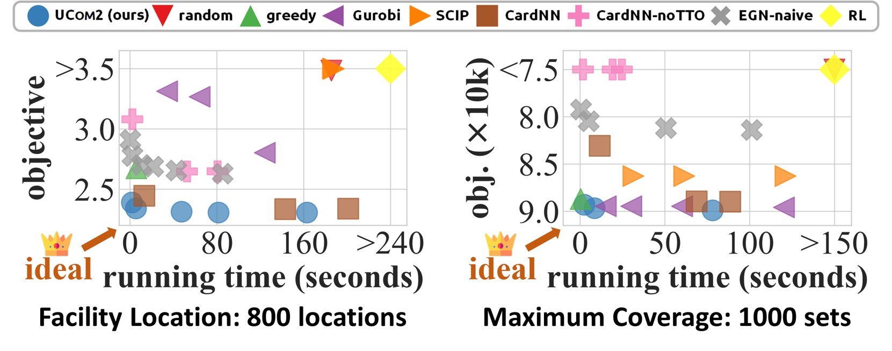

# Tackling Prevalent Conditions in Unsupervised Combinatorial Optimization

Source code for the ICML'24 paper **Tackling Prevalent Conditions in Unsupervised Combinatorial Optimization: Cardinality, Minimum, Covering, and More**, where we study and propose <strong>UCom2</strong> (<ins><strong>U</strong></ins>nsupervised <ins><strong>Com</strong></ins>binatorial Optimization <ins><strong>U</strong></ins>nder <ins><strong>Com</strong></ins>monly-involved Conditions).

The "facility_location_and_max_cover" folder contains the code for the experiments on facility location and maximum coverage.

The "robust_coloring" folder contains the code for the experiments on robust coloring.

Please check the README file in each folder for the guidance for the experiments on each problem.

### Citation

    @inproceedings{bu2024ucom2,
        title={Tackling Prevalent Conditions in Unsupervised Combinatorial Optimization: Cardinality, Minimum, Covering, and More},
        author={Bu, Fanchen and Jo, Hyeonsoo and Lee, Soo Yong and Ahn, Sungsoo and Shin, Kijung},
        booktitle={ICML},
        year={2024}
    }
